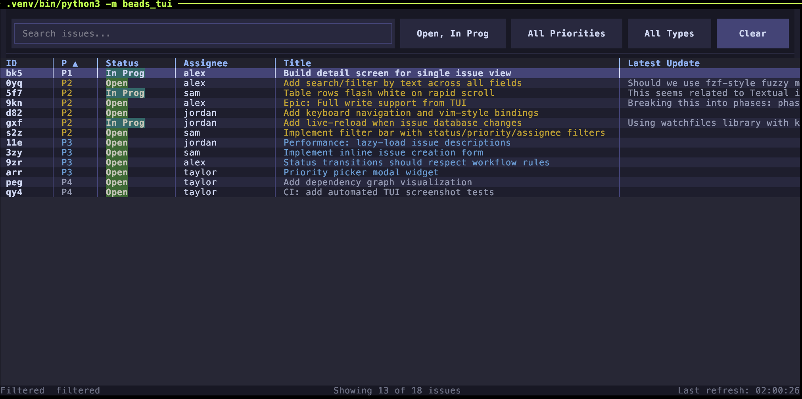

# Beads TUI

An interactive terminal user interface for the [Beads](https://github.com/steveyegge/beads) issue tracker. Provides a keyboard-driven, feature-rich alternative to the `bd` CLI for managing issues that live in your git repository.




## Features

- **Issue list** with sortable columns, inline search, and multi-select filters (status, priority, type)
- **Detail view** with editable fields, comments, and navigable linked issues
- **Create issues** directly from the TUI with type, priority, assignee, labels
- **Live reload** automatically refreshes when issues change on disk
- **Vim-style navigation** (`hjkl`, `/` to search, `?` for help)
- **Quick actions** from the list: change priority (`p`), status (`s`), close (`x`)

## Requirements

- Python 3.11+
- [Beads CLI](https://github.com/steveyegge/beads) (`bd`) installed and in PATH

## Installation

```bash
pip install beads-tui
```

For development:

```bash
git clone https://github.com/gm2211/beads-tui.git
cd beads-tui
pip install -e .
```

## Usage

```bash
bdt                                        # Launch the TUI
bdt --all                                  # Include closed issues
bdt --columns id,priority,status,title     # Custom columns
bdt --bd-path /path/to/bd                  # Custom bd binary
bdt --db-path /path/to/db                  # Custom database path
```

## Keyboard Shortcuts

### List View

| Key | Action |
|-----|--------|
| `j` / `k` | Move down / up |
| `Enter` | Open issue detail |
| `/` | Focus search bar |
| `c` | Create new issue |
| `p` | Change priority |
| `s` | Change status |
| `x` | Close issue |
| `o` | Sort picker |
| `#` | Toggle column visibility |
| `A` | Toggle show all / open only |
| `r` | Refresh |
| `i` | Toggle short / full IDs |
| `?` | Help |
| `q` | Quit |

### Detail View

| Key | Action |
|-----|--------|
| `j` / `k` | Scroll down / up |
| `l` | Focus linked issues |
| `h` | Return to scroll |
| `p` | Change priority |
| `s` | Change status |
| `a` | Change assignee |
| `e` | Edit title |
| `d` | Edit description |
| `C` | Add comment |
| `g` | Go to linked issue |
| `Escape` / `Enter` | Back to list |

### Filter Modals

| Key | Action |
|-----|--------|
| `j` / `k` / `h` / `l` | Navigate options |
| `Space` | Toggle checkbox |
| `Escape` | Cancel |

## Available Columns

`id`, `priority`, `status`, `type`, `title`, `assignee`, `updated`, `created`, `labels`, `deps`, `latest_update`

## Project Structure

```
beads_tui/
  app.py              Main application
  bd_client.py        Async bd CLI wrapper
  models.py           Data models
  screens/
    create_screen.py   New issue dialog
    detail_screen.py   Issue detail view
    help_screen.py     Keyboard shortcut reference
  widgets/
    filter_bar.py      Search and filter bar
    status_bar.py      Bottom status bar
    status_picker.py   Status selection modal
    priority_picker.py Priority selection modal
    text_input_modal.py Generic text input modal
  mixins/
    live_reload.py     File-watch live reload
  styles/
    app.tcss           Textual CSS
```

## License

MIT
